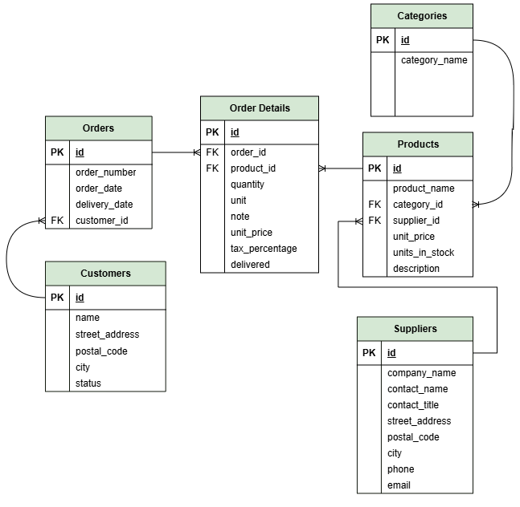

## ER Diagram



## Routes availeble

### Customer

| Routes | Method | Description |
| --- | --- | --- |
| `/api/customer` | `GET` | Fetch all customer data including the number of all orders and the total sum of purchased products |
| `/api/customer/:id` | `DELETE` | Remove a customer by ID |

### Order

| Routes | Method | Description |
| --- | --- | --- |
| `/api/order/:customer_id` | `GET` | fetch all orders and order details related to customer id |
| `/api/order` | `POST` | Create a new order with at least one order detail attached to it |
| `/api/order_details/:order_id` | `PUT` | Update (an array of) order details |


### Product

| Routes | Method | Description |
| --- | --- | --- |
| `/api/product/category` | `GET` | Fetch products by category |
| `/api/product/:id` | `GET` | Fetch product by ID |
| `/api/product` | `GET` | Fetch all products |
| `/api/product` | `POST` | Create a new product |

### Supplier

| Routes | Method | Description |
| --- | --- | --- |
| `/api/supplier` | `GET` | Fetch all suppliers |
| `/api/supplier` | `POST` | Add a new supplier |
| `/api/supplier/:id` | `PUT` | Modify a supplier |
| `/api/supplier/:id` | `DELETE` | Remove a supplier |

## Installation

1. **Clone the repository:**
   ```bash
   git clone https://github.com/dmas5/express-order-management-app.git

2. **Install dependencies:**
   ```bash
   npm install

3. **Configure MySQL:**

- Create a MySql database (db.sql file)
- Connect to your database and insert commands from inventory.sql

4. **Set up env variables:**

- Create a `.env` file in the root directory.
- Add the following variables:
```makefile
PORT=3004
HOSTNAME=127.0.0.1
DB_HOST=localhost
DB_USER=your-user-name
DB_PASSWORD=your-password
DB_NAME=inventory
```

5. **Start the server with:**
   ```bash
npm start.js

## Project Structure

```text
Inventory_management_system/
├── app/
│   ├── controllers/
│   │   ├── customerController.js    Handles request for cusomer data
│   │   ├── orderController.js       Handles request for order and order detail
│   │   ├── productController.js     Handles request for product data
│   │   └── supplierController.js    Handles request for supplier data
│   ├── db/
│   │   ├── customer_orderSQL.js     Db interaction with (order,order_detail)
│   │   ├── productSQL.js            Db interaction with table (product)
│   │   └── supplierSQL.js           Db interaction with table (supplier)
│   ├── routes/
│   │   ├── customerRoutes.js        Routes for customer (get,delete)
│   │   ├── orderRoutes.js           Routes for order (get,post,put)
│   │   ├── productRoutes.js         Routes for product (get,post)
│   │   └── supplierRoutes.js        Routes for supplier (get,post,put,delete)
│   ├── services/
│   │   └── sql.js                   Helper function for db interaction
│   └── server.js
├── inventory.sql                    SQL table definitions & insert statements
├── db.sql                           Create database             
└── start.js                         Main file
```

